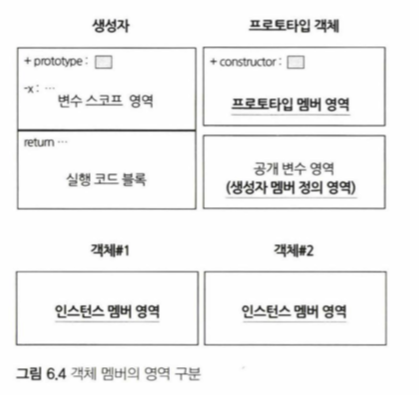
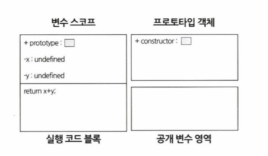

# 객체 Object

자바스크립트는 `class` 문이 포함되지 않은 프로토 타입 언어다. 기본적으로는 `function`을 `class`로서 사용한다고 한다. 
만약 자바스크립트에서 `class` 키워드를 본다면 그건 ECMAScript 6 에서 지원해주기 때문이다. 내부적으로는 새로운 객체 (상속) 모델은 아니고 결국엔 `function` 이라고 한다.

함수가 객체를 생성하는 역할을 한다고 하지만 그렇다고 클래스와 동일한 개념은 아니다. 자바스크립트 언어에서는 함수에 전달되는 객체가 어떤 타입인지 중요하지도 않고 타입 체크도 하지 않는다.
(덕타이핑?)

> 자바스크립트의 타입 시스템에서는 객체에 속성과 메서드가 존재하는지 여부는 해당 객체의 타입을 통해서가 아니라 실제 런타임에 호출해봐야 알 수 있다.

## 객체 생성 방법
자바스크립트에서 객체를 생성하는 방법은 3가지가 있다.

### new 를 사용하는 경우

<pre><code>var mySon = new Object();
</pre></code>

`new` 키워드를 사용할 땐 사실 괄호 `()` 를 빼도 된다. 이럴 경우 생성자 매개변수에는 `undefined`가 들어간다.

자바스크립트에선 기존에 멤버를 정의 하지 않고 다음과 같이 추가도 가능하다.

<pre><code>mySon.Name = "김뫄뫄"
mySon.Age = 0
mySon.IncreaseAge = function(i){ this.Age + i; };
</code></pre>

### 객체 리터럴을 사용하는 경우

<pre><code>var mySon = {
    Name: "김뫄뫄",
    Age: 0
}
// 키로 사용하는 부분을 문자열로 사용해도 가능하다.
</code></pre>

이 방법은 내부적으로 `new Object` 를 수행한 후 멤버를 구성하는 방법과 동일한 절차를 따른다.

그러므로 아래와 같이 작성도 가능하다.

<pre><code>var mySon = {}; // var mySon = new Object(); 와 동일
</pre></code>

### 사용자 정의 객체 정의

사용자 정의의 객체를 정의하기 위해 자바스크립트 에서는 `class` 라는 키워드 대신 `function` 을 사용한다.

<pre><code>function Person(name) {
    this.name = name;
}
</code></pre>

사실 자바스크립트에서는 함수의 `function` 과 객체를 생성할 때의 `function` 이 동일하다.

## 객체 멤버 관리

### 멤버

자바스크립트의 멤버 접근 방법은 아래의 것들이 있다.

- obj.member = 10;
- obj\["member"\] = 10;

1번은 그렇다 치고, 2번이 가능한 이유는 객체별로 멤버를 관리하는 데이터 구조가 (키, 값) 쌍으로 구성되어 있기 때문이다. 자바스크립트는 내부적으로 
이러한 데이터 구조를 해시로 사용하는데 정확히는 `연상 배열(associative array)` 라는 것을 사용한다.

### 연상 배열

일반 배열은 순차적인 데 반해, `연상 배열` 은 그렇지 않다. 키로 접근이 가능한 구조로, 일반적으로 검색 속도는 대단히 빠르다고 한다. 
단, 키는 문자열만 사용이 가능하고 유니크 해야 한다. 키의 값으로는 어떠한 타입이든 상관이 없다.

연상 배열 안에서 속성과 메서드를 따로 구분 짓지 않기 때문에 자바스크립트 입장에선 괄호의 유무가 속성이냐 메서드냐를 판단하는 근거가 된다. 다시 말하자면, 
자바스크립트에선 멤버는 그냥 모두 공개된 var 변수와 다를바가 없다는 것이다.

### 생성자 멤버와 객체 멤버

자바스크립트의 생성자 역시 일반 객체라, 속성과 메서드도 추가 가능하다. 이렇게 생성된 생성자 멤버는 또 해당 생성자의 객체 멤버와는 별도의 연상 배열 구조에서 관리 된다. 
그리고 객체 멤버든 다시 인스턴스 멤버와 프로토타입 멤버로 구분된다.

생성자 멤버가 정의되는 곳과 프로토타입 멤버가 정의되는 곳은 각각 함수별로(즉 생성자별로) 하나만 존재한다. 그리고 인스턴스 멤버가 정의되는 곳은 인스턴스 별로 존재한다.

### 멤버 접근

생성자도 객체이기 때문에 아래와 같은 표현식이 가능하다.

<pre><code>function Obj() {}
obj.wow = '히히';
console.log(obj.wow);
</code></pre>

생성자에 멤버 속성을 추가 했으니 해당 생성자를 통한 객체를 생성해서 해당 속성을 호출할 수 있을 것 같지만 사실 그럴 수는 없다.

<pre><code>var o = new Obj();
console.log(o.wow); // error!!
</code></pre>

왜냐하면 앞에서 이야기 했듯이 생성자와 해당 객체는 각각의 다른 멤버 영역을 가지고 있기 때문이다!

### 멤버 관리

- 속성을 추가 하고 싶다면 처음부터 있던 것 처럼 그냥 `obj.props = "땡땡떙"` 와 같이 사용하면 된다.
- 속성을 삭제 하고 싶으면 `delete` 키워드를 사용하면 된다.
- 해당 속성을 가지고 있는지 확인하고 싶으면 `hasOwnProperty` 메서드를 사용하자.
- `in` 연산자도 `hasOwnProperty` 와 같은 역할을 하지만, `in`은 `Object`의 원래 멤버도 연산의 대상으로 한다. (toString 같은 메서드!)
- 자바스크립트는 위에서 말한 것 처럼 __연상 배열__ 구조를 사용하다 보니 `for ... in` 문을 통한 순회도 가능하다.

## prototype, constructor, 인스턴스

함수를 정의하면 다음과 같은 모델이 구성된다.

생성자도 함수로서 이와 동일한 구조로 생성된다.

생성자, 프로토타입 객체는 함수를 정의하면 함께 정의되는 객체이고 인스턴스는 생성을 해야 얻게 되는 객체다.

### 프로토 타입 prototype 객체

생성자에는 `prototype` 이라는 공개 속성이 있는데, 이 속성을 통해 프로토타입 객체에 접근할 수 있다.
프로토타입 객체에 접근해 멤버를 추가하거나 삭제하려 반드시 생성자의 `prototype` 속성을 이용해야 한다. 프로토타입 객체는 생성자별로 하나만 정의된다.

해당 생성자의 `prototype` 을 통해 추가하면 그 멤버는 해당 생성자의 모든 인스턴스에서 사용할 수 있게 된다.

<pre><code>function Person() {}

var p1 = new Person();
p1.name = "김땡땡";

Person.prototype.getName = function () {
    return this.name;
};

// Person 에 프로토타입으로 getName 이라는 익명함수를 추가했는데 p1 에서 사용이 가능하다!
console.log(p1.getName());
</code></pre>

이것이 가능한 이유는 __모든 인스턴스는 해당 생성자가 가지고 있는 프로토타입 객체의 멤버를 상속받기 때문__ 이다.

> 프로토타입 멤버에서의 `this` 는 현재 인스턴스를 나타낸다.

프로토타입 객체는 함수를 메모리에 정의할 때 한 번만 생성된다. 프로토타입 멤버는 인스턴스 별로 복사본이 존재하는 것이 아니며 그 생성자의 모든 인스턴스가 함께 공유하게 된다.
그렇다면 새롭게 값을 쓸 경우엔 어떻게 될까?

<pre><code>Person.prototype.age = 1;
p1.age = 2;
p2.age = 3;
</code></pre>

위와 같이 생성자의 프로토타입에 age 라는 속성/값을 지정하고 p1, p2 라는 인스턴스에 새롭게 썼다. (p1, p2 는 Person의 객체)
p1, p2의 인스턴스에는 age 라는 멤버가 없다. 이럴 경우 `getName` 처럼 프로토타입에서의 속성을 찾고 해당 값을 업데이트 할 것 같지만 실제로는 그렇지 않다.

<pre><code>console.log(Person.prototype.age); // 1
console.log(p1.age); // 2
console.log(p2.age); // 3
</code></pre>

그 이유는 인스턴스 하나에서 값을 수정하더라도 다른 객체에 영향을 미치게 하는 것을 막기 위해서이기 때문이다. 만약 전체 인스턴스에 영향을 주는 업데이트를 하고 싶다면, 프로토타입 객체 멤버를 
직접 수정하면 된다.

<pre><code>Person.prototype.age = 100;
console.log(Person.prototype.age); // 100
console.log(p1.age); // 100
console.log(p2.age); // 100
</code></pre>

삭제하고 싶다면 인스턴스에서 멤버 삭제 하는 것과 마찬가지로 `delete` 키워드를 쓰면 된다. (단, 인스턴스에서의 삭제가 아니라 생성자의 프로토타입에서의 삭제라는 것을 잊지말자!)

### 생성자

프로토타입 객체의 멤버로 있는 `constructor` 는 해당 프로토타입 객체를 생성했던 함수에 대한 참조이다.
즉, 이 `constructor` 속성은 원본 생성자 함수 자신을 가리키고 있는 것이다.

<pre><code>Person -> prototype
prototype.cosntructor -> Person
</code></pre>

위와 같이 된다. 고로 아래는 모두 참이다.

<pre><code>p1.constructor == Person.prototype.constructor
p1.constructor == Person
p1.constructor.prototype == Person.prototype
</code></pre>

`constructor` 도 런타임에 변경할 수 있다.

## 멤버 접근 제어 구조

자바스크립트에서는 비공개 멤버를 만드는 방법을 지원하지 않는다.

### 비공개 멤버 구현

함수의 지역 변수는 외부에서 접근할 수 없는 비공개 변수이므로 이러한 지역 변수가 객체의 상태값을 가지고 있으면 된다. 그러나 이럴 경우 공개 멤버가 비공개 변수에 
직접 접근할 수 없게 되므로, 공개 멤버는 또 내부 변수에 접근할 수 있는 내부 함수를 두고서 이 함수를 통해 내부 상태값에 접근해야 한다.

## 읽어보면 좋을 글
- [https://developer.mozilla.org/ko/docs/Learn/JavaScript/Objects/Object_prototypes](https://developer.mozilla.org/ko/docs/Learn/JavaScript/Objects/Object_prototypes)
