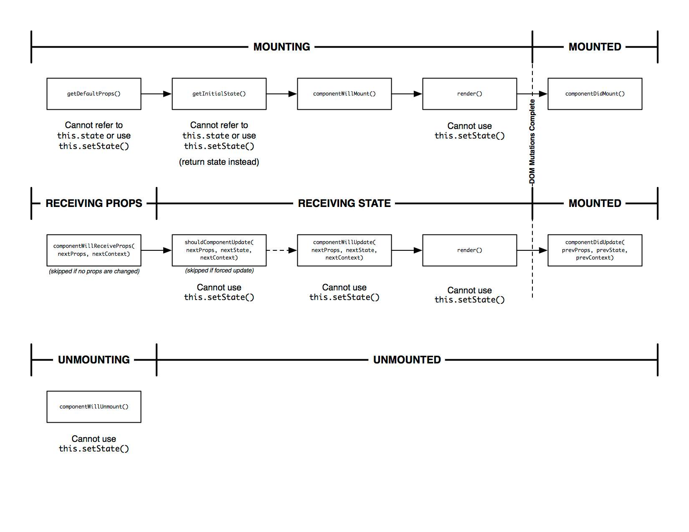

## React Tutorial

### render() 함수
컴포넌트 모양새를 정의. 라이프사이클 메서드 중 유일한 필수 메서드. 이 메서드 안에서는 __절대로 state를 변형해서는 안되며, 웹 브라우저에 접근해서도 안된다.__

### props
`props` 는 properties 를 줄인 표현으로 컴포넌트 속성을 설정할 때 사용하는 요소이다.
부모 컴포넌트에서 props 를 지정할 수도 있지만 해당 컴포넌트에서 `defaultProps` 로 기존 props 를 지정할 수도 있다.

컴포넌트의 필수 props 를 지정하거나 타입을 지정할 때는 propTypes 를 사용한다.

### state
컴포넌트 내부에서 읽고 또 업데이트 할 수 있는 값을 사용하려면 `state` 를 써야 한다.
미리 값을 설정해야 사용할 수 있으며, `this.setState()` 메서드로만 값을 업데이트 한다.

## props 와 state
`props` 와 `state` 는 둘 다 컴포넌트에 대한 정보를 가지는 값들이다. 하지만 `props` 는 값을 변경해서는 안되어야 한다.

즉, 컴포넌트 내에서 `props` 는 값을 변경하면 안되고, 오직 부모 혹은 자기 자신에서 사전이 이미 설정한 값으로만 사용해야 한다. 값을 업데이트 하기 위해서는 `state` 를 사용해야 하는 것이다.

리액트의 생명 주기를 이해하면 더 이해를 잘 할 수 있다 (고 하는데 나는 이해를 못함 ;D ... )

참고
* [리액트 props 와 state](https://medium.com/little-big-programming/react%EC%9D%98-%EA%B8%B0%EB%B3%B8-%EC%BB%B4%ED%8F%AC%EB%84%8C%ED%8A%B8%EB%A5%BC-%EC%95%8C%EC%95%84%EB%B3%B4%EC%9E%90-92c923011818)
